# Face recognition

> 정보보호 시간에 아주 살짝 언급했었던 내용이었습니다.
>
> 지문과 같이 사람을 식별해 줄 수 있는 고유의 값으로 사용할 수 있다는 개념에서 생체인식으로 이용될 수 있다고 배웠던 것 같은데 성형수술이나 일란성 쌍둥이를 구별하는데 값이 정밀하지 못해 아직 기술적인 보안이 필요하다고 배웠던 기억이 납니다. 🙄
>
> 직접 구현해 볼 수 있는 기회가 있어서 재미있었습니다.


## 1. Face recognition이란?

안면 인식 시스템은 디지털 이미지를 통해 각 사람을 자동으로 식별하는 컴퓨터 지원 응용 프로그램을 말한다. 이는 살아 있는 이미지에 나타나는 선택된 얼굴 특징과 안면 데이터베이스를 서로 비교함으로써 이루어집니다. 

일반적으로 보안 시스템으로 사용되며 지문이나 동공 인식 시스템과 같읕 다른 생체 인식과 비교 될 수있습니다. 

옛날엔 아주 먼 미래의 일처럼 내 안면인식 데이터로 현관 비밀번호를 대체해 영화에서만 보던 장면이었는데 아이폰에 잠금 기술에 적용되어 보다 가깝게 느껴지는 것 같습니다. 

생체인식 값 중 가장 대중적으로 사용 되는 지문 인식 시스템에 가장 취약한 지문을 가지고 있는 저로써는 이러한 아이폰의 기술이 보다 혁신적이고 편리하게 느껴졌습니다. 다한증과 얇은 손 피부로 100번 중 1번도 제대로 인식하지 못했던 지문과는 달리 얼굴은 어떤 각도나 화장기술로도 저의 얼굴을 인식하기 때문에 보다 편리했지만 요즘은 코로나 때문에 필수적으로 써야하는 마스크 때문에 조금 불편한 것 이외에 아주 혁신적으로 잘 사용하고 있습니다. ㅎㅎ 


## 2. Google Colab

그렇다면 이런 혁신적인 기술을 보다 간편하고 접근성이 좋게 사용할 수 있는 파이썬 패키지를 구글에서 제공 한다고 해서 과제로 수행해 보았습니다.😎

Colab은 Jupyter Notebook에 추가로 python 소스코드를 Google의 클라우드 컴퓨팅 환경에서 GPU와 TPU를 무료로 사용 할 수 있고 소스토드나 데이터를 Google Drive를 통해 불러오거나 저장할 수도 있는 개발 환경 입니다.

Cloud 기반이므로 별도의 설치과정이  필요 없으며 딥러닝, M/L, 데이터 사이언스 분야에서 사용되고 있습니다. 

[Colab 공부 gogo](https://colab.research.google.com/notebooks/intro.ipynb#scrollTo=P-H6Lw1vyNNd)

### 2.1 Google Drive의 ipynb파일과 Colab연결하기

Google Drive에 colab이라는 디렉토리를 생성한 후, 난이도에 따라 basic.ipynb와 advanced.ipynb 파일을 업로드 합니다.

(참고로 ipynb 파일은 과학자들이 파이썬 언어와 데이터로 작업 할 수 있도록 도와주는 인터랙티브 한 계산 환경 인 Jupyter Notebook에서 사용하는 노트 문서입니다.)

​	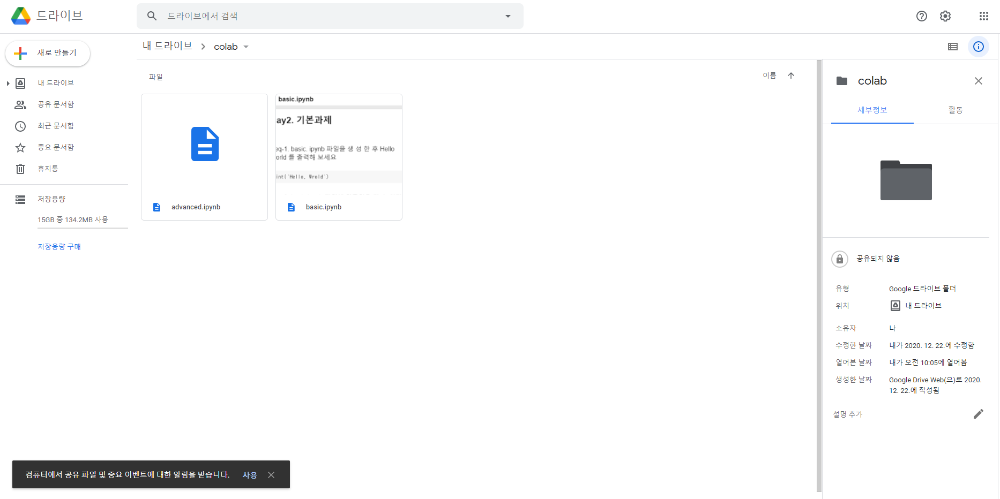

이후, 업로드 된 basic.ipynb을 더블 클릭 한 후 상단의 "연결 앱" 버튼을 누르면 다음과 같이 " 더많은 앱 연결하기"를 선택 할 수 있습니다. 

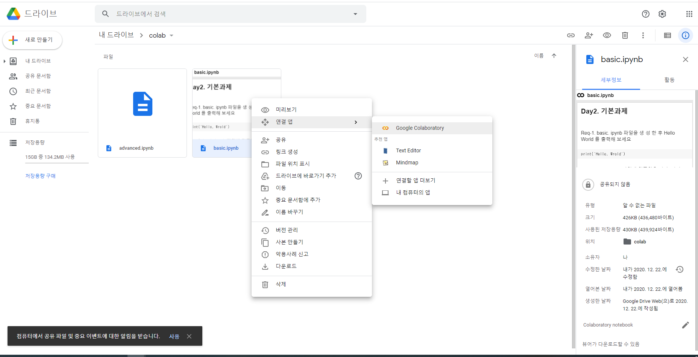

이후 다음과 같이 검색창에 "colab"을 검색하고 "연결"버튼을 누르면 구글 드라이브의 ipynb파일을 colab과 연결 할 수 있습니다.

연결 완료후 ipynb파일을 더블클릭하면 다음과 같이 Colab으로 연동이 됩니다. 


### 2.2 Google Colab - 코드 스니펫

간단한 print문과 사측연산 부터 matlab과 다소 비슷한 형식의 패키지들을 제공하기도 하는데 Colab에서는 재사용이 가능한 코드와 다양한 예제가 좌측의 `<>`모양의 아이콘을 클릭하면 사용할 수 있도록 제공하고 있습니다.

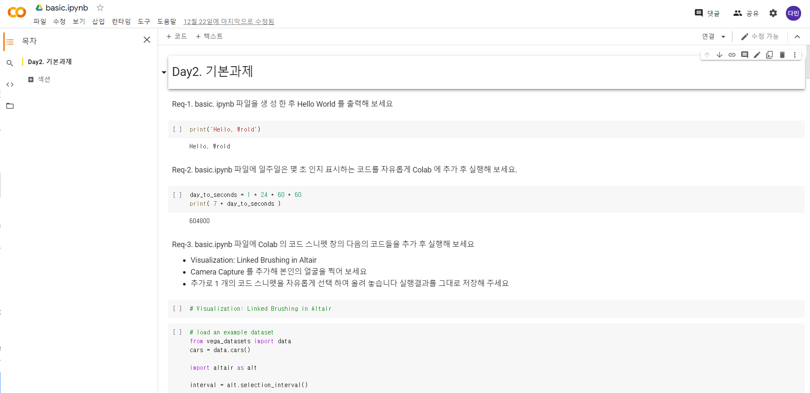


### 2.3 Google Colab - Google Drive 연동

Colab에서는 간단한 인증 과정을 거쳐 Google Drive와 연동을 하여 데이터를 읽어고더나 연산 결과를 저장 할 수 있습니다.  


이런식으로 google Drive와 연동하여 데이터를 읽어올 수 있는데 

[google drive 연동하기](https://somjang.tistory.com/entry/Google-Colab%EC%97%90%EC%84%9C-Google-Drive%EC%99%80-%EC%97%B0%EB%8F%99%ED%95%98%EA%B8%B0)

참고하기 좋은 블로그 글도 함께 올리겠습니다🙂


### 2.4 Colav에서 GPU / TPU사용 

Colab에서는 Google 에서 제공하는 GPU와 TPU를 몇가지 제약사항이 있지만 무료로 사용해 코드를 실행 할 수 있습니다.

CPU와 GPU의 단순계산시 속도 차이를 구할 수도 있습니다.

머신러닝의 기본은 GPU성능이라고 할 정도로 핫한 부분입니다. 내 컴퓨터에 성능이 좋지 못한 GPU가 있다고 한들 앞서 언급한 내용처럼 Google의 클라우드 컴퓨팅 환경에서 GPU와 TPU를 무료로 사용 할 수 있기 때문에 내 컴퓨터 사양과는 크게 상관 없이 일정한 서비스를 제공 받을 수 있습니다.😆


### 2.5 colab에서 OpenCV 라이브러리를 사용한 그래픽 처리

이 부분은 사실 `matlab`과 비슷하다는 생각을 많이 했습니다.

복잡하고 해석하기 어려운 데이터 값을 보다 쉽게 이해 할 수 있도록 영상처리를 할 수 있는 라이브러리를 제공합니다.

자세한 사항은 링크를 걸어 둘테니 활용해 보시면 좋을 것 같습니다.

[OpenCV 공식사이트](https://opencv.org/)

[OpenCV 파이썬 튜토리얼](https://docs.opencv.org/master/d6/d00/tutorial_py_root.html)

2D 그래프 제공

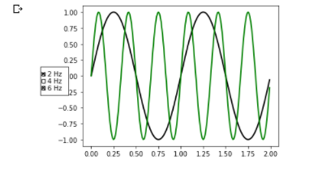

3D 그래프 제공 

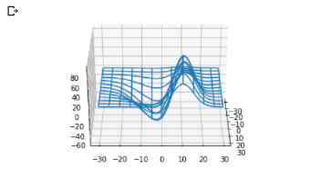


## 3.Face conginition 구현해 보기 

요즘 사용하는 스마트폰에는 사용자 앨범의 사진들을 Deep Learning 기술을 사용해 탐색하여 사람의 얼굴인지 여부를 판독한 후, 사용자로부터 일므을 입력 받으며 약간의 학습과정을 거쳐 인물별로 자동으로 분류를 해주는 기능을 제공하고 있습니다.

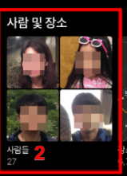

이런 기능들을 구현하기 위해서는 가장 기본적으로 필요한 기술이 사진에서 얼굴을 찾아내 얼굴이 표시된 영역을 알아내야 하는데 이를 Face Detection이라고 하고, 감지된 얼굴데이터를 기반으로 동일한 인물을 찾아내 인식하는 것을 Face Recognition 얼굴인식이라고 합니다.

GPU 및 TPU 가속이 제공되는 Google Colab상에서 Python 기반의 face_recognition 패키지를 사용하여 여러 가지 얼굴인식 모델을 경험해 보고 이를 활용하여 간단한 과제를 수행해 봅니다🤔

### 3.1 여러사람이 들어있는 사진에서 사람의 얼굴을 감지해서 사각형을 그리는 코드

face-recongnition 패키지의 기본 내용은 아래의 링크를 참고 하시길 바랍니다.

https://pypi.org/project/face-recognition/

https://github.com/ageitgey/face_recognition

Google Colab에 런타임 유형을 담으과 같이 Python3 / GPU로 변경합니다.

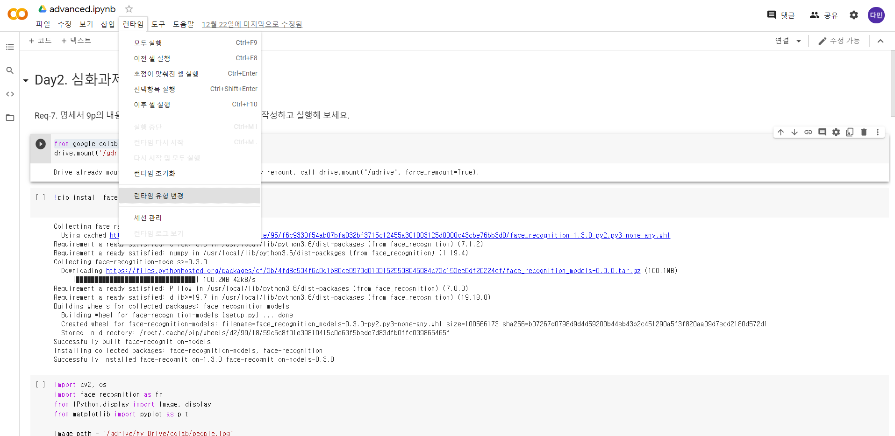


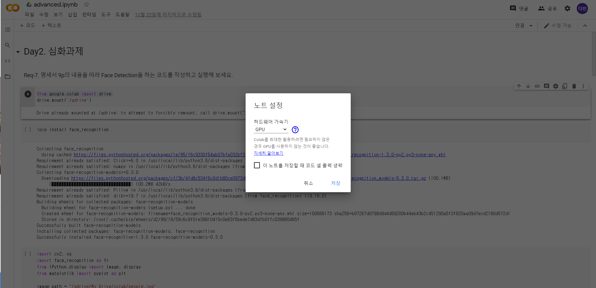


코드스니펫(`<>`)의 [Google Drive 연동 코드](https://somjang.tistory.com/entry/Google-Colab%EC%97%90%EC%84%9C-Google-Drive%EC%99%80-%EC%97%B0%EB%8F%99%ED%95%98%EA%B8%B0)를 추가한 후 링크를 클릭하여 Authorization code를 복사해서 붙여 넣어 줍니다. 

그리고 pip 명령어를 사용하여 face_recognition package를 설치합니다.

```python 
!pip install face_recognition
```

여러 사람의 얼굴이 들어있는 사진 한 장을 준비해서 구글 드라이브에 올려 놓고 이미지 파이이 업로드 된 Google Drive의 경로명, 디렉토리명, 파일명을 설정해 줍니다. **이 때 Google Drive의 Default 경로가 /gdrive/My Drive/이라는 것을 알아야 합니다 **


Google Drive에서 사진 불러오기

```python
import cv2, os 
import face_recognition as fr 
from IPython.display import Image, display 
from matplotlib import pyplot as plt 

image_path = "/gdrive/My Drive/colab/people.jpg"
```

다음처럼 face_recognitio 패키지의 기본 HOG(Histogram of Oriented Grandient) 모델을 사용해 얼굴감지를 하고 사각형을 그려 줍니다. 

```python
image = fr.load_image_file(image_path)
face_locations = fr.face_locations(image)
for (top, right, bottom, left) in face_locations :
  cv2.rectangle(image, (left, top), (right, bottom), (0, 255, 0), 3)

plt.rcParams['figure.figsize'] = (16, 16)
plt.imshow(image)
plt.show()
```

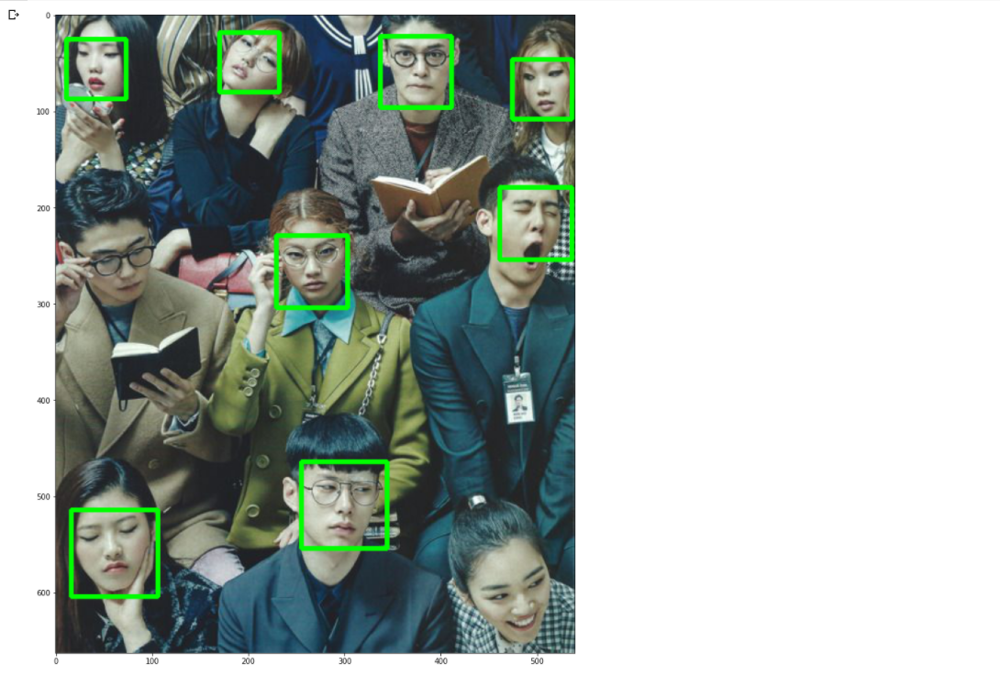

**측면의 얼굴도 인식은 하지만 위에처럼 안경쓰고 밑을 보고 있다던지 컴퓨터가 인식하기에 얼굴형과 안맞는다고 생각하는 얼굴은 인식하지 않는 것같습니다.**


### 3.2 얼굴을 학습해서 새로운 사진이 들어왔을 때 학습된 데이터의 사진을 비교해서 누군지 알려주는 코드

face_location()함수를 사용하여 사진에서 얼굴영역을 찾는 기능을 3.1에서 구현했습니다.

이번에는 몇장의 인식된 얼굴영역에서 데이터를 추출하여 여러사진들이 동일한 사람의 사진인지를 확인하는 방법을 알아 보겠습니다.

face_recognition 패키지에서는 인물사진에서 인식한 얼굴영역을 복사하여 라이브러리에서 사용하는 데이터구조로 encoding을 한 후 이 encoding된 데이터를 이용하여 동일인 여부를 확인 합니다. 

즉, 2장의 사진에서 encoding 된 2개의 얼굴 데이터를 face_distance()의 파라메터로 전달하여 두 사진간의 distance를 얻어내고, distance값이 0.6 이상이면 타인으로 볼 수 있고 0.6 미만이면 동일인으로 볼 수 있습니다. 

좀 더 엄격한 기준으로 동일인 인식을 하고 싶으면 수치를 조금 낮춰 distance 0.5를 기준으로 로직을 작성하면 됩니다. 


4장의 인물자신을 준비해서 구글 드라이브에 업로드 후 다음처럼 이미지파일을 읽어서 known_person_list에 추가합니다. 

```python
# 동일 인물인지를 찾는 코드
plt.rcParams['figure.figsize'] = (1, 1)

# 이미지 파일을 로드하여 known_person_list 리스트 생성 
known_person_list = []
known_person_list.append(fr.load_image_file("/gdrive/My Drive/colab/person1.jpg"))
known_person_list.append(fr.load_image_file("/gdrive/My Drive/colab/person2.jpg"))
known_person_list.append(fr.load_image_file("/gdrive/My Drive/colab/person3.jpg"))
known_person_list.append(fr.load_image_file("/gdrive/My Drive/colab/person4.jpg"))
```


다음처럼 face_location()함수를 사용해 4장의 사진에서 얼굴을 감지해 잘라내어서 known_face_list에 저장합니다.

```python
# 4명의 얼굴을 인식하여 감지된 부분을 잘라낸 다음 known_face_list에 저장
known_face_list = []
for person in known_person_list :
  # 얼굴 좌표를 알아내서 잘라낸다.
  top, right, bottom, left = fr.face_locations(person)[0]
  face_image = person[top:bottom, left:right]

  # known_face_list에 잘라낸 face_image를 저장
  known_face_list.append(face_image)
```


known_face_list를 출력해보면 다음과 같이 얼굴들이 저장되어 있습니다.

```python
# 저장된 얼굴 출력해 보기
for face in known_face_list :
  plt.imshow(face)
  plt.show()
```

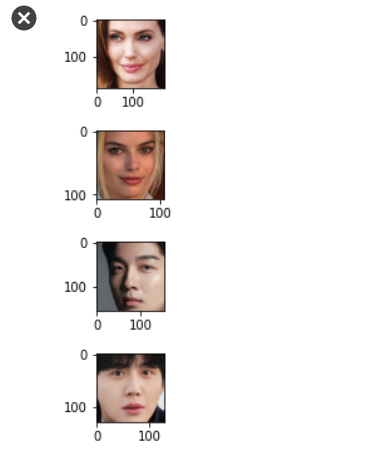

누구인지 모르는 인물사진 unknown.jpg도 얼굴인식을 한 후, 다음처럼 잘라서 unknown_face에 저장합니다.

```python
# 기존 리스트에 없는 새로운 파일을 열어서
unknown_person = fr.load_image_file("/gdrive/My Drive/colab/unknown.jpg")

#새로운 파일의 얼굴좌표를 알아내서 잘라낸다
top, right, bottom, left = fr.face_locations(unknown_person)[0]
unknown_face = unknown_person[top:bottom, left:right]

#unknown_face라는 타이틀을 붙여서 표시
plt.title("unknown_face")
plt.imshow(unknown_face)
plt.show()
```

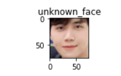

이후, face_encoding()함수를 사용해 enc_unknown_face 에 얼굴영역을 인코딩해 저장합니다. 

```python
# face_encoding() 함수를 이용해 enc_unknown_face에 얼굴 영역을 인코딩
enc_unknown_face = fr.face_encodings(unknown_face)

# 화면에 표시 
plt.imshow(enc_known_face)
plt.show()
```

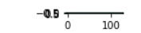


다음과 같이 face_distance() 함수를 사용해 known_face_list에 저장된 기존 4명의 얼굴과 새로 입력된 unknown_face의 distance를 구합니다.

일반적으로 distance가 0.6 이상이면 타인이라고 볼 수 있으나 다른 사람이라도 비슷한 사람은 0.5대 distance가 나오기도 합니다.


등록된 얼굴 리스트들과 비교해 사진과 같은 사람이 있는지 찾아봅니다.

```python
# 등록된 얼굴리스트를 비교 (distance 값을 이용해 같은 사람인지 아닌지 구별)
for face in known_face_list :
  # 등록된 얼굴을 128-dimensional face 인코딩 
  enc_known_face = fr.face_encodings(face)
  # 등록된 얼굴과 새로운 얼굴의 distance를 얻기
  distance = fr.face_distance(enc_known_face, enc_unknown_face[0])

  # distance 수치를 포함한 얼굴 출력 
  plt.title("distance:" +str(distance))
  plt.imshow(face)
  plt.show()
```

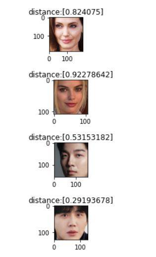

python 기반의 이미지 처리방법이나 얼굴 인식등 혹은 Machine Leaning, Deep Learing 등에 이용할 수 있습니다


## 4. 추가학습 

> 위에서 요즘 핫하다는 기술을 직접 구현해 봤는데 그렇다면 인공지능과 Ai를 활용한 안면 인식기술의 원리와 활용 부분이 어디있을까 궁금증이 생기게 되었습니다.
>
> 추가학습 페이지에선 이런 궁금증을 해결하기 위해 작성 했습니다.😮


### 4.1 안면 인식시스템의 원리

안면 인식 시스템은 대부분 ‘협력 시스템’ 개념을 기반으로 구축됩니다. 미리 정해진 거리에서 적절한 조명과 함께 카메라를 똑바로 바라보고 찍은 이미지를 데이터베이스에 저장된 검증된 이미지와 대조하는 방식입니다. 

이런 유형의 시스템은 국경 통제와 물리 보안 시스템에서 광범위하게 사용되고 있습니다.


이보다 더 흥미로운 개념은 바로 군중 속 특정 얼굴을 인식하는 `‘비협력 시스템(non-cooperative systems)’`입니다. 

조명과 얼굴 각도 모두가 제 각각인 상황에서 안경, 스카프, 모자를 착용했거나 심지어 움직이는 사람들을 인식해야 합니다.

~~‘이미저스 테크놀로지(Imagus Technology)’라는 호주 기업이 바로 이런 작업을 수행하는 군중 속 안면 인식 시스템을 개발했습니다.~~

기업이 브랜드 이름을 바꾸려는 방향으로 새로운 기업 이름으로 되어있는 홈페이지가 있어 링크를 첨부하겠습니다.

[vixVIZION](https://www.vixvizion.com/)

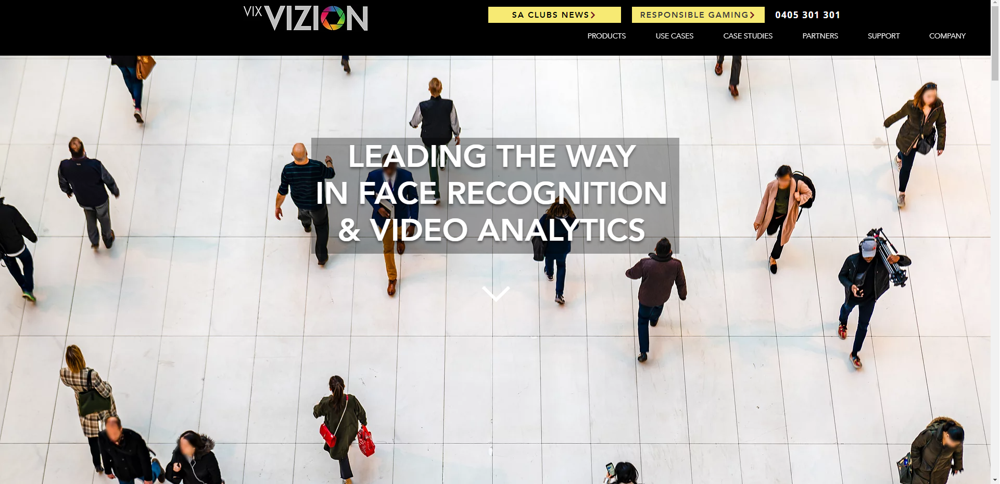


꾸준히 기술을 개발하고 있는 모습도 기사를 통해 볼 수 있습니다.😶

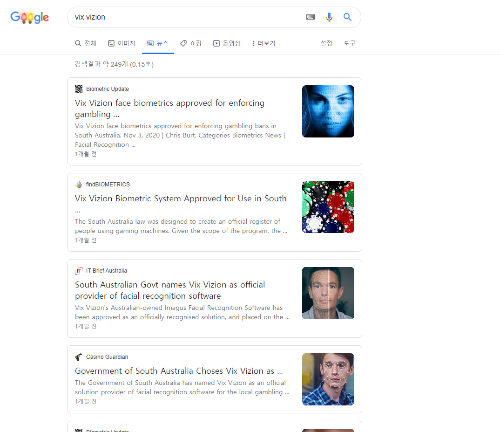


그렇다면 어떻게 안면 인식을 하는걸까요?🤔

진짜 원리를 언급하겠습니다.

안면 인식 시스템은 골격과 같은 저주파 질감(low-frequency textures)을 통해 얼굴의 통계 모델을 구성합니다. 

피부의 점, 속눈썹, 주름, 눈가 잔주름과 같은 아주 높은 주파수의 특징을 이용하는 시스템도 있지만 매우 높은 품질의 이미지가 요구됩니다. 

사람들이 지나다니는 현실에서 움직임은 흐릿하고 카메라 각도도 변하기 때문에 저주파 정보가 훨씬 더 적합합니다!

인물 리터칭 작업에 사용된다는 저주파 질감을 이용한 보정법은 질감과 피부톤을 분리하여 보정할 수 있는 방법으로, 인물사진 리터칭 작업을 수월하게 만들어 줍니다. 

물론 고주파를 이용해 피부의 주름이나 모공같은 질감을 보정해 줄 수 있지만 피부컬러등을 보정하는 저주파를 사용하는게 훨씬 생동감있는 얼굴을 구별해 내기 쉬운 방법인 것 같습니다. 


### 4.2 생체 인식, 비밀번호의 대안으로 떠오르다. 

생체 인식(Biometrics) 역시 결제 시스템의 편의성과 사기 방지를 위해 빠르게 도입되고 있습니다. 

가장 대중적인 생체 지표(biometric marker)는 지문과 안면 인식인데요. 일반적으로 이중 팩터 인증 시스템의 일부로 구축됩니다.

 2016년 마스터카드는 보다 빠르고 안전한 온라인 구매를 위해 ‘셀피 페이(Selfie Pay)’ 앱을 출시했습니다. 

온라인 결제 시 셀카를 찍어 보내면 즉시 인증이 가능합니다.

아이폰 유저라면 얼굴인식으로 결제가 손쉽게 이루어지는 경험도 해보셨을 거라고 생각이 듭니다.

지문 인식기는 모든 휴대폰에 장착돼 있지 않지만 카메라는 거의 모든 휴대폰에 들어가 있습니다. 

향후 제대로 보안 기능을 갖춘 생체 인식이 다중 팩터 인증 프로세스의 일부로 도입되면 수많은 앱과 웹사이트에서 비밀번호를 일일이 기입하지 않아도 될 것으로 기대됩니다.

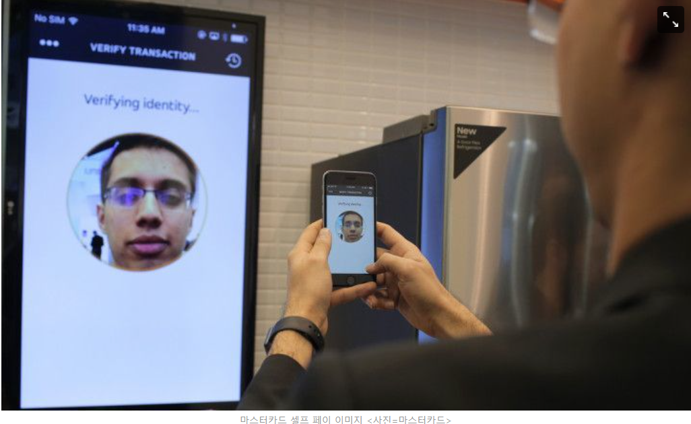


### 4.3 안면 인식시스템의 다양한 활용

안면 인식 시스템은 신원 파악뿐 아니라 다양한 마케팅과 인구 통계에 활용되고 있습니다. 


기사내용 발췌

출처: https://www.yna.co.kr/view/AKR20200526135100005

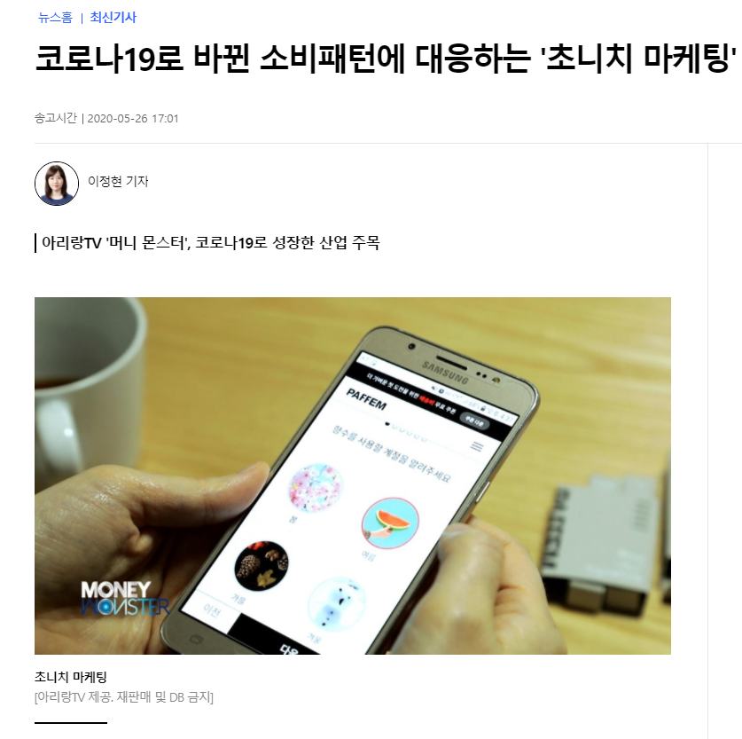

최근 경기 침체로 소비 규모를 줄이는 대신 꼭 필요한 기능과 특징을 가진 제품·플랫폼을 받고자 하는 소비자가 늘고 있다. 이에 기업들은 '니치(틈새)'를 더 세분화해 개인 맞춤 상품과 서비스를 제공하는 '초니치 마케팅'을 펼치고 있다.


그중 안면인식 기술은 편의성이 뛰어나고 보안성까지 높아 비대면 산업에 핵심기술로 자리 잡았다.

성동구청은 AI 안면인식 열 감지 카메라를 도입했다. 건물 출입 전 AI 안면인식 열 감지 카메라 앞에 서서 마스크의 착용 여부와 체온 측정을 거치는 철저한 방역 시스템으로 시민의 불안감을 해소해 나가고 있다.

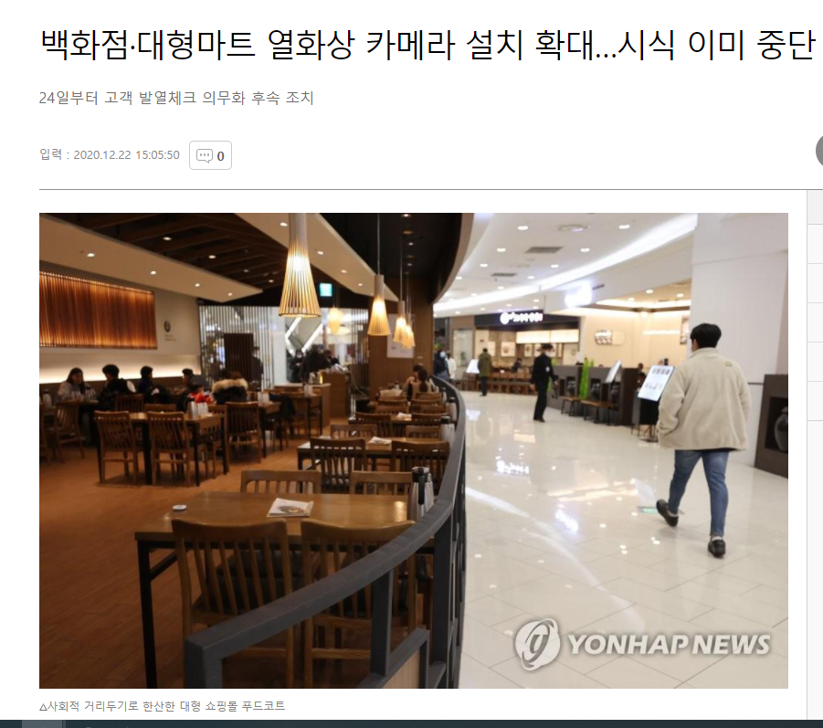

현재 광주 교육장에서 뿐만 아니라 다른 여러 건물에서도 열 감지 카메라가 도입되어 체온을 측정해본 경험이 다들 있으실거라고 생각이 듭니다.


또한 인공지능 카메라를 매장에 설치하며 소비자들의 패턴을 상세하게 분석해 주는 기술도 인기를 끌고 있습니다. 

출처 : https://www.boannews.com/media/view.asp?idx=77220&kind=0

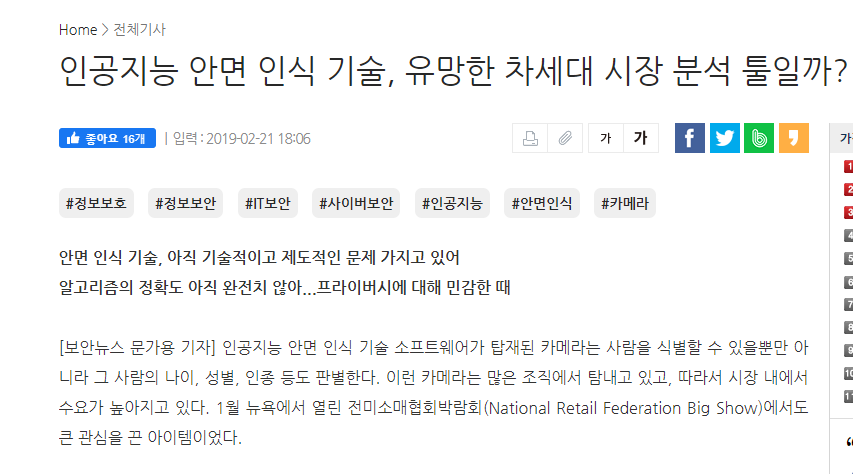

왜 이렇게 이런 카메라들이 인기를 끄는 것일까? 먼저는 인공지능 카메라를 매장에 설치하면 소비자들의 패턴을 보다 상세히 분석할 수 있기 때문이다. 어떤 연령과 성별의 소비자들이 어떤 물건을 어떤 방식으로 구매하고 소비하는지 알게 되면 경쟁에서 우위에 설 수 있게 된다. 아마존 같은 대형 업체도 이런 식으로 소비자들과 시장을 연구한다는 건 익히 알려진 사실이다.


### 4.4 사생활 문제

신기술은 언제나 양날의 검입니다.

사람들은 더 빠르고 안전한 전자상거래, 빠른 공항 보안 검색대 통과와 같은 혜택을 누리기 위해 생체 인식 시스템을 이용합니다. 그렇지만 기업이 생체 데이터를 안전하게 관리하고 명시된 목적으로만 사용하고 거기에 따른 정보보호의 문제도 기업이 감당해야 한다고 생각합니다.

나도 모르는 사이에 내 모습이 찍혀 동의 없이 활용 된다면 그만큼 불쾌할 수 없을 것 같습니다.


### 5. MS에서 제공하는 이미지에서 얼굴을 분석하는 AI서비스 

다양한 IT회사에서도 최신 API를 제공합니다. 

결과값을 이용해 사람의 표정을 해석 할 수 있도록 만들수도 있습니다. 

다양한 사례에서 이용되는 API들도  많이 있으니 추가적으로 학습하시면 도움이 될 것 같습니다. 

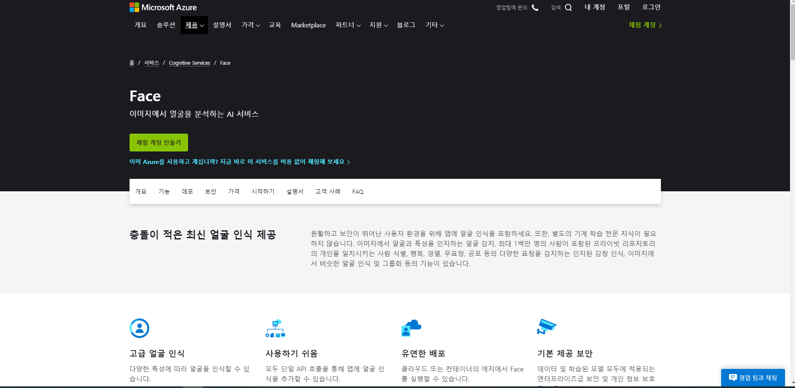

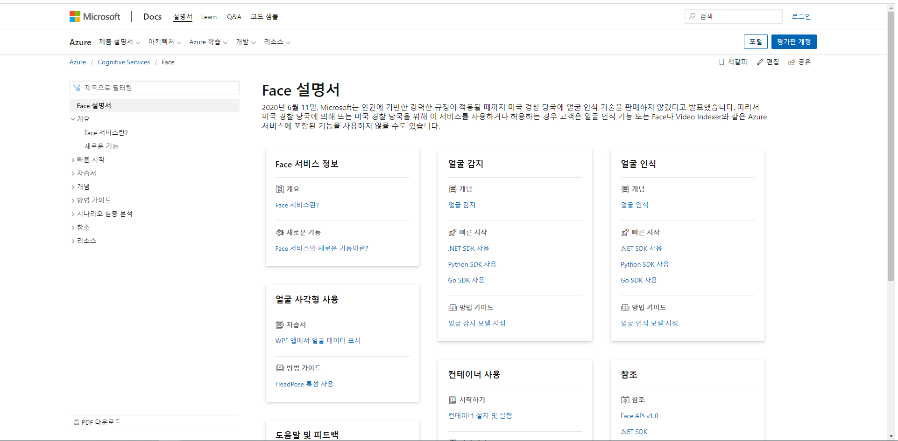
